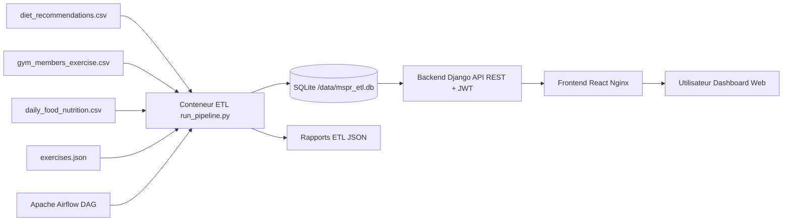
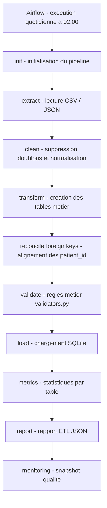

# README Soutenance - HealthAI Coach

Ce document sert de fiche de révision pour la soutenance. Il résume le projet, les choix techniques, le pipeline ETL, Docker, Airflow, l'API, le frontend, la base de données et les réponses à préparer pour le jury.

## Pitch court

HealthAI Coach est une plateforme de coaching santé personnalisée par la donnée. Le projet intègre plusieurs sources de données liées à la santé, à la nutrition, à l'activité physique et aux exercices, puis les transforme via un pipeline ETL pour alimenter une base SQLite. Cette base est exposée par une API REST Django sécurisée par JWT, puis consommée par un frontend React.

La partie technique couvre :

- un pipeline ETL complet en Python/Pandas ;
- une modélisation relationnelle centrée sur le patient ;
- une API REST documentée avec Swagger/OpenAPI ;
- un frontend React avec tableaux, graphiques, pagination et exports ;
- une industrialisation avec Docker ;
- une orchestration avec Apache Airflow ;
- des rapports, métriques et snapshots de monitoring.

## Phrase d'introduction possible

> Notre projet répond à un besoin de centralisation et d'exploitation de données santé. Nous avons construit une chaîne complète : ingestion de fichiers hétérogènes, nettoyage, transformation, validation, chargement en base, exposition API, visualisation frontend et orchestration automatisée.

## Objectif du projet

L'objectif est de transformer des données brutes de santé et d'activité en données exploitables pour un outil de coaching.

Le projet permet :

- d'ingérer plusieurs sources de données ;
- de nettoyer et standardiser les données ;
- de créer un modèle relationnel cohérent ;
- d'exposer les données via une API REST ;
- d'afficher les indicateurs dans une interface web ;
- de lancer l'ensemble facilement avec Docker ;
- d'automatiser le pipeline avec Airflow.

## Architecture générale

```text
Sources CSV / JSON
        |
        v
Pipeline ETL Python / Pandas
        |
        v
Base SQLite mspr_etl.db
        |
        v
Backend Django REST API + JWT
        |
        v
Frontend React / Nginx
        |
        v
Utilisateur final
```

Avec Docker et Airflow :

```text
Docker Compose
  |-- etl
  |-- backend
  |-- frontend
  |-- airflow-apiserver
  |-- airflow-scheduler
  |-- airflow-dag-processor
  |-- airflow-triggerer
  |-- airflow-postgres
```

## Stack technique

| Partie | Technologie | Rôle |
|---|---|---|
| ETL | Python, Pandas | Extraction, nettoyage, transformation, validation |
| Base | SQLite | Stockage métier du projet |
| API | Django, Django REST Framework | Exposition des données |
| Sécurité | JWT | Authentification stateless |
| Documentation API | OpenAPI / Swagger | Documentation et test des endpoints |
| Frontend | React, Vite | Interface utilisateur |
| Déploiement web | Nginx | Service du build frontend |
| Conteneurisation | Docker, Docker Compose | Lancement reproductible |
| Orchestration | Apache Airflow | Planification et suivi du pipeline |
| Métadonnées Airflow | PostgreSQL | Base interne d'Airflow |
| Tests | unittest, Django test framework | Validation technique |

## Sources de données

| Source | Format | Rôle |
|---|---|---|
| `diet_recommendations.csv` | CSV | Source principale pour patient, santé, nutrition et activité physique |
| `gym_members_exercise.csv` | CSV | Données de séances sportives |
| `daily_food_nutrition.csv` | CSV | Journal alimentaire externe |
| `exercises.json` | JSON | Catalogue d'exercices |

Point important : les sources ne viennent pas toutes du même référentiel. Le pipeline doit donc harmoniser les colonnes, aligner les identifiants et supprimer les lignes incohérentes.

## Pipeline ETL

Le pipeline est dans le dossier `Pipelines/`.

Fichier principal :

```text
Pipelines/pipeline.py
```

Le pipeline suit ces étapes :

```text
extract -> clean -> transform -> validate -> load -> metrics -> report
```

Avec Airflow, les étapes sont encore plus détaillées :

```text
init -> extract -> clean -> transform -> validate -> load -> metrics -> report -> monitoring
```

### 1. Extraction

Le pipeline lit les fichiers sources :

- CSV avec `pd.read_csv` ;
- JSON avec `pd.read_json` ;
- support possible d'Excel via `pd.read_excel`.

Les fichiers chargés par défaut :

```text
diet_recommendations.csv
gym_members_exercise.csv
daily_food_nutrition.csv
exercises.json
```

Phrase orale :

> L'extraction récupère les sources hétérogènes du projet. On a plusieurs CSV et un JSON, donc le pipeline commence par charger ces formats dans des DataFrames Pandas.

### 2. Nettoyage

Le nettoyage applique :

- suppression des doublons ;
- normalisation des chaînes de caractères ;
- préparation des données avant transformation.

Phrase orale :

> Le nettoyage vise à stabiliser les données avant la modélisation. On supprime les doublons et on normalise les champs texte pour éviter que des différences de casse ou d'espaces créent des incohérences.

### 3. Transformation

La transformation crée les tables relationnelles finales.

Tables générées :

| Table | Description |
|---|---|
| `patient` | Entité pivot du modèle |
| `sante` | Données médicales liées au patient |
| `nutrition` | Données nutritionnelles et recommandations |
| `activite_physique` | Niveau d'activité et heures d'exercice |
| `gym_session` | Séances sportives détaillées |
| `food_log` | Journal alimentaire externe |
| `exercise` | Catalogue d'exercices |

Transformations importantes :

- renommage des colonnes source vers des noms propres ;
- création de `patient_id` si absent ;
- calcul et catégorisation de certains indicateurs ;
- standardisation des dates ;
- création d'identifiants techniques pour certaines tables.

Phrase orale :

> La transformation est l'étape centrale. On passe de fichiers bruts à des tables métier cohérentes, avec des noms de colonnes standardisés et des relations exploitables par l'API.

### 4. Réconciliation référentielle

Problème rencontré :

Les datasets n'utilisent pas toujours les mêmes identifiants patient. Exemple :

```text
P001
P00001
```

Solution :

La méthode `_reconcile_foreign_keys()` réaligne les formats d'identifiants et supprime les lignes orphelines dont le `patient_id` n'existe pas dans la table `patient`.

Pourquoi c'est important :

- garantit l'intégrité référentielle ;
- évite les erreurs Django lors des migrations ou vérifications de contraintes ;
- rend la base cohérente.

Phrase orale :

> Un point technique important a été la réconciliation des clés étrangères. Les fichiers ne partageaient pas toujours le même format d'identifiant patient. Nous avons donc ajouté une étape qui réaligne les IDs et supprime les lignes impossibles à rattacher à un patient.

### 5. Validation

La validation repose sur :

```text
Pipelines/rules.py
Pipelines/validators.py
```

Elle vérifie :

- les types attendus ;
- les bornes numériques ;
- les valeurs autorisées ;
- la cohérence métier ;
- les champs obligatoires.

Exemples :

- âge dans une plage réaliste ;
- calories positives ;
- type de repas parmi `Breakfast`, `Lunch`, `Dinner`, `Snack` ;
- niveau d'expérience sport parmi des valeurs attendues.

Phrase orale :

> La validation agit comme un garde-fou métier. Elle permet de détecter les données aberrantes avant leur chargement en base.

### 6. Chargement

Le chargement utilise le schéma SQL versionné :

```text
BDD.sql
```

Stratégie :

1. `CREATE TABLE IF NOT EXISTS` pour garantir le schéma ;
2. suppression des anciennes lignes dans l'ordre inverse des dépendances ;
3. insertion des nouvelles données avec Pandas ;
4. conservation des contraintes et index.

Pourquoi ce choix :

- le schéma est stable ;
- les contraintes de clés étrangères restent actives ;
- le chargement est reproductible ;
- la base est entièrement régénérable.

### 7. Métriques et rapports

Le pipeline génère :

- statistiques par table ;
- nombre de lignes ;
- nombre de colonnes ;
- taux de null ;
- valeurs uniques ;
- statistiques numériques ;
- rapport JSON dans `reports/`.

Exemple de sortie :

```text
reports/etl_report_YYYYMMDD_HHMMSS.json
```

### 8. Monitoring

Le monitoring lit les rapports ETL et produit un snapshot :

```text
etl_monitoring_latest.json
```

Il surveille :

- nombre d'erreurs ;
- nombre de warnings ;
- volume de lignes ;
- taux minimum de validation ;
- tendance entre plusieurs runs.

## Modèle de données

Le modèle est centré sur `patient`.

```text
patient
  |-- sante
  |-- nutrition
  |-- activite_physique
  |-- gym_session
```

Tables indépendantes :

```text
food_log
exercise
etl_run
```

### `patient`

Entité pivot.

Champs principaux :

- `patient_id` ;
- `age` ;
- `gender` ;
- `weight_kg` ;
- `height_cm` ;
- `bmi_calculated` ;
- `bmi_category` ;
- `age_group`.

### `sante`

Données santé du patient :

- cholestérol ;
- pression artérielle ;
- type de maladie ;
- glucose ;
- sévérité.

Relation :

```text
sante.patient_id -> patient.patient_id
```

### `nutrition`

Données nutritionnelles :

- apport calorique ;
- restrictions ;
- allergies ;
- cuisine préférée ;
- recommandation de régime ;
- adhérence au plan.

Relation :

```text
nutrition.patient_id -> patient.patient_id
```

### `activite_physique`

Données d'activité :

- niveau d'activité physique ;
- heures d'exercice hebdomadaires.

Relation :

```text
activite_physique.patient_id -> patient.patient_id
```

### `gym_session`

Séances de sport :

- durée ;
- calories brûlées ;
- type d'entraînement ;
- fréquence ;
- niveau d'expérience ;
- BPM ;
- eau consommée ;
- calories par heure.

Relation :

```text
gym_session.patient_id -> patient.patient_id
```

### `food_log`

Journal alimentaire externe.

Champs :

- date ;
- `user_id` ;
- aliment ;
- catégorie ;
- calories ;
- protéines ;
- glucides ;
- lipides ;
- fibres ;
- sucres ;
- sodium ;
- cholestérol ;
- type de repas ;
- eau consommée.

Point important pour la soutenance :

`food_log` n'est pas relié à `patient`, car il vient d'un dataset indépendant. Le `user_id` est l'identifiant interne de ce dataset alimentaire, pas un `patient_id` fiable.

Réponse si le jury demande "Pourquoi pas de FK vers patient ?" :

> Parce que la source `daily_food_nutrition.csv` ne garantit pas que ses `User_ID` correspondent aux patients de `diet_recommendations.csv`. Créer une clé étrangère artificielle aurait donné une fausse relation. On a préféré garder cette table comme source externe exploitable pour des analyses alimentaires globales.

### `exercise`

Catalogue d'exercices venant du JSON.

Champs :

- nom ;
- partie du corps ;
- cible musculaire ;
- équipement ;
- niveau ;
- instructions.

### `etl_run`

Table de métadonnées qui historise les exécutions ETL :

- début ;
- fin ;
- durée ;
- statut ;
- tables chargées ;
- total de lignes ;
- erreurs ;
- warnings.

## Backend API

Dossier :

```text
backend/
```

Technologies :

- Django ;
- Django REST Framework ;
- JWT ;
- OpenAPI / Swagger ;
- SQLite comme base métier.

### Modèles Django

Les modèles métier sont dans :

```text
backend/api/models.py
```

Ils sont en `managed = False`, car les tables sont créées par le schéma SQL ETL (`BDD.sql`) et non par les migrations Django.

Pourquoi :

> Le schéma métier est produit et versionné par le pipeline ETL. Django lit ces tables et les expose, mais il ne doit pas les recréer ou les modifier automatiquement.

### Endpoints principaux

| Endpoint | Rôle |
|---|---|
| `/api/patients/` | Liste et détail des patients |
| `/api/sante/` | Données de santé |
| `/api/nutrition/` | Données nutritionnelles |
| `/api/activite-physique/` | Activité physique |
| `/api/gym-sessions/` | Séances sportives |
| `/api/pending-changes/` | Workflow d'approbation admin |
| `/api/auth/token/` | Connexion JWT |
| `/api/auth/token/refresh/` | Refresh token |
| `/api/auth/me/` | Infos utilisateur connecté |
| `/api/kpis/` | KPIs globaux |
| `/api/engagement/` | KPIs engagement |
| `/api/conversion/` | KPIs conversion |
| `/api/satisfaction/` | KPIs satisfaction |
| `/api/data-quality/` | KPIs qualité des données |
| `/api/docs/` | Swagger UI |

### Sécurité

Le backend utilise JWT.

Principe :

- l'utilisateur se connecte ;
- l'API renvoie un access token et un refresh token ;
- le frontend stocke les tokens ;
- chaque requête protégée envoie `Authorization: Bearer <token>` ;
- le refresh token permet de renouveler l'access token.

Phrase orale :

> Nous avons choisi JWT pour une authentification stateless. Le serveur n'a pas besoin de stocker une session utilisateur, ce qui simplifie l'architecture API.

### Serializers

Les serializers DRF jouent le rôle de pare-feu :

- sérialisation des objets vers JSON ;
- validation des champs entrants ;
- protection contre les données mal formées.

### Workflow d'approbation admin

Fonctionnalité importante :

Les utilisateurs non superviseurs ne modifient pas directement les données ETL. Leurs modifications créent une demande `PendingChange`.

Comportement :

- superviseur : modification directe ;
- utilisateur normal : demande en attente ;
- superviseur : approuve ou rejette.

Pourquoi :

- protéger les données issues de l'ETL ;
- garder une traçabilité des modifications ;
- éviter des changements non validés.

Phrase orale :

> Comme les données viennent d'un pipeline ETL, on évite les modifications directes non contrôlées. Les utilisateurs peuvent demander une modification, mais elle doit être validée par un superviseur.

## Frontend

Dossier :

```text
frontend/
```

Technologies :

- React ;
- Vite ;
- Axios ;
- Chart.js ;
- Nginx en production Docker.

### Rôle du frontend

Le frontend consomme l'API et affiche :

- les patients ;
- les données de santé ;
- les données nutritionnelles ;
- l'activité physique ;
- les séances sportives ;
- les KPIs ;
- les écrans d'administration ;
- les demandes de modification.

### Service API

Fichier :

```text
frontend/src/services/api.js
```

Il centralise :

- appels API ;
- gestion JWT ;
- refresh token ;
- pagination ;
- récupération des KPIs ;
- appels d'approbation admin.

### Pages importantes

| Page | Rôle |
|---|---|
| `Login.jsx` | Connexion utilisateur |
| `Dashboard.jsx` | Vue globale |
| `Patients.jsx` | Annuaire patient et détail |
| `Health.jsx` | Graphiques santé |
| `Nutrition.jsx` | Données nutritionnelles |
| `Activity.jsx` | Activité physique et sport |
| `Analytics.jsx` | Analyses complémentaires |
| `Admin.jsx` | Administration, qualité, pending changes |

### Fonctionnalités frontend notables

- pagination côté API ;
- recherche patient ;
- tableaux administrables ;
- graphiques ;
- exports CSV/JSON ;
- rafraîchissement des tokens JWT ;
- gestion des droits superviseur ;
- composants réutilisables.

## Docker

Fichier :

```text
docker-compose.yml
```

Docker sert à lancer toute la plateforme avec la même configuration.

Services principaux :

| Service | Rôle |
|---|---|
| `etl` | Génère la base SQLite à partir des fichiers sources |
| `backend` | Lance Django/Gunicorn et expose l'API |
| `frontend` | Sert l'application React via Nginx |
| `airflow-postgres` | Base metadata interne Airflow |
| `airflow-init` | Initialise Airflow et crée l'utilisateur admin |
| `airflow-apiserver` | Interface/API Airflow sur le port 8080 |
| `airflow-scheduler` | Planifie les DAGs |
| `airflow-dag-processor` | Analyse les DAGs |
| `airflow-triggerer` | Gère les tâches asynchrones Airflow |
| `airflow-permissions` | Prépare les permissions des volumes |

Volumes :

| Volume | Rôle |
|---|---|
| `sqlite_data` | Stocke `/data/mspr_etl.db` et les rapports |
| `airflow_postgres_data` | Stocke les métadonnées Airflow |

Pourquoi Docker est important :

- lancement reproductible ;
- isolation des services ;
- moins de problèmes d'environnement ;
- même configuration pour tous les membres ;
- base partagée entre ETL et backend via volume.

Phrase orale :

> Docker nous permet de faire tourner toute la plateforme de manière reproductible. L'ETL, le backend, le frontend et Airflow ont chacun leur environnement isolé, tout en partageant les données nécessaires via des volumes.

Commande principale :

```bash
docker compose up --build
```

Accès :

```text
Frontend : http://localhost
Airflow : http://localhost:8080
Backend : accessible via le frontend / proxy Docker
```

## Airflow

Fichiers :

```text
airflow/dags/mspr_daily_etl.py
airflow/run_etl_step.py
```

Airflow sert à orchestrer le pipeline ETL.

### DAG

Nom :

```text
mspr_daily_etl
```

Planification :

```text
Tous les jours à 02:00
```

Configuration :

```text
schedule="0 2 * * *"
catchup=False
timezone="Europe/Paris"
```

Étapes :

```text
etl_init
01_extract_sources
02_clean_data
03_transform_model
04_validate_rules
05_load_sqlite
06_calculate_metrics
07_generate_report
08_monitoring_snapshot
```

Pourquoi Airflow :

- automatiser le pipeline ;
- visualiser chaque étape ;
- relancer uniquement une tâche si besoin ;
- consulter les logs ;
- planifier des traitements réguliers ;
- rendre la chaîne data plus industrialisée.

Phrase orale :

> Airflow transforme notre pipeline Python en workflow supervisé. Chaque étape est une tâche visible dans l'interface. En cas d'erreur, on identifie rapidement si elle vient de l'extraction, du nettoyage, de la transformation ou du chargement.

### Pourquoi PostgreSQL avec Airflow ?

PostgreSQL ne stocke pas les données métier HealthAI.

Il stocke les métadonnées Airflow :

- DAGs ;
- runs ;
- états des tâches ;
- logs et informations d'exécution ;
- utilisateurs Airflow.

Les données métier restent dans SQLite :

```text
/data/mspr_etl.db
```

Réponse au jury :

> PostgreSQL est utilisé par Airflow pour son propre fonctionnement. Notre application métier utilise SQLite, générée par l'ETL.

## Rapports et qualité

Le projet produit deux niveaux de suivi :

1. Rapport ETL détaillé ;
2. Snapshot de monitoring.

### Rapport ETL

Contient :

- statut global ;
- tables traitées ;
- nombre total de lignes ;
- erreurs ;
- warnings ;
- validation par table ;
- métriques.

### Monitoring

Contient :

- état global : OK, WARNING ou CRITICAL ;
- alertes ;
- seuils utilisés ;
- tendance entre les derniers runs.

Seuils par défaut :

- maximum erreurs : `0` ;
- maximum warnings : `250` ;
- minimum lignes : `1000` ;
- taux de validation minimum : `99%`.

## Tests

Le projet contient des tests dans :

```text
tests/
backend/api/tests.py
```

Ils couvrent notamment :

- création des tables par l'ETL ;
- présence de `food_log` ;
- validations pipeline ;
- monitoring ;
- endpoints backend ;
- workflow d'approbation ;
- KPIs.

Commandes utiles :

```bash
python -m pytest
```

ou selon l'environnement :

```bash
./run_coverage.sh
```

## Points forts du projet

À valoriser pendant la soutenance :

- pipeline ETL complet et découpé ;
- gestion de sources hétérogènes CSV/JSON ;
- nettoyage et validation métier ;
- réconciliation référentielle des IDs ;
- schéma SQL versionné ;
- API REST sécurisée par JWT ;
- documentation Swagger ;
- frontend React fonctionnel ;
- workflow d'approbation admin ;
- Docker Compose complet ;
- orchestration Airflow ;
- rapports et monitoring ;
- tests automatisés.

## Limites actuelles

À reconnaître si le jury demande :

- SQLite est adapté au projet et à la démo, mais pas idéal pour un usage cloud multi-utilisateur à grande échelle ;
- `food_log` n'est pas relié aux patients car la source ne garantit pas la correspondance ;
- les données sont issues de datasets statiques, pas encore d'objets connectés réels ;
- Airflow orchestre le pipeline, mais le déploiement cloud complet reste une perspective ;
- certaines analyses IA avancées ne sont pas encore implémentées.

## Perspectives d'évolution

Techniques :

- migrer SQLite vers PostgreSQL pour la production ;
- renforcer l'orchestration Airflow ;
- ajouter CI/CD ;
- ajouter tests d'intégration bout en bout ;
- déployer sur AWS ou Azure ;
- connecter des sources temps réel.

Produit :

- recommandations plus personnalisées ;
- connexion à des objets connectés ;
- espace nutritionniste ;
- offre B2B pour salles de sport, mutuelles et entreprises ;
- suivi long terme des objectifs santé.

## Questions possibles du jury et réponses

### Pourquoi avoir choisi SQLite ?

Réponse :

> SQLite est simple, léger et suffisant pour une preuve de concept. Il permet de générer rapidement une base locale avec l'ETL et de la partager entre les conteneurs via un volume Docker. Pour une mise en production, nous prévoyons une migration vers PostgreSQL.

### Pourquoi Pandas pour l'ETL ?

Réponse :

> Pandas est adapté aux fichiers CSV/JSON et aux transformations tabulaires. Il permet de renommer les colonnes, nettoyer, filtrer, calculer des indicateurs et préparer les DataFrames avant chargement SQL.

### Pourquoi le patient est l'entité pivot ?

Réponse :

> Le patient centralise les dimensions santé, nutrition et activité. Les tables `sante`, `nutrition`, `activite_physique` et `gym_session` se rattachent à lui via `patient_id`, ce qui permet une lecture cohérente du profil global.

### Pourquoi `food_log` n'est pas reliée à `patient` ?

Réponse :

> Le journal alimentaire vient d'un dataset indépendant. Son `User_ID` ne correspond pas de manière fiable au `patient_id` du dataset principal. On a donc préféré éviter une fausse relation et garder cette table comme source alimentaire externe.

### À quoi sert Docker ?

Réponse :

> Docker garantit que le projet tourne dans le même environnement pour tout le monde. Il isole l'ETL, le backend, le frontend et Airflow, tout en partageant la base SQLite via un volume.

### À quoi sert Airflow ?

Réponse :

> Airflow orchestre le pipeline ETL. Il lance les étapes dans le bon ordre, planifie l'exécution quotidienne à 02:00, donne accès aux logs et permet de repérer précisément l'étape qui échoue.

### Pourquoi utiliser JWT ?

Réponse :

> JWT permet une authentification stateless adaptée à une API REST. Le backend ne garde pas de session serveur, et le frontend transmet le token dans les requêtes protégées.

### Pourquoi les modèles Django sont en `managed=False` ?

Réponse :

> Parce que le schéma des tables métier est créé par `BDD.sql` dans le pipeline ETL. Django ne doit pas gérer ces tables avec ses migrations, il doit seulement les lire et les exposer via l'API.

### Comment garantissez-vous la qualité des données ?

Réponse :

> La qualité est contrôlée à plusieurs niveaux : règles de validation métier, suppression des incohérences référentielles, métriques par table, rapports JSON et monitoring avec seuils.

### Que se passe-t-il si une étape Airflow échoue ?

Réponse :

> Airflow marque la tâche en erreur et conserve ses logs. Comme le pipeline est découpé en étapes, on sait directement si le problème vient de l'extraction, du nettoyage, de la transformation, de la validation ou du chargement.

### Pourquoi un workflow d'approbation admin ?

Réponse :

> Les données viennent d'un pipeline ETL, donc elles doivent être protégées contre des modifications directes non contrôlées. Le workflow `PendingChange` permet à un utilisateur de demander une modification et à un superviseur de la valider ou de la rejeter.

## Déroulé oral conseillé

### 1. Contexte

> HealthAI Coach est une plateforme de coaching santé basée sur la donnée. Elle cible des utilisateurs qui veulent suivre leur santé, leur nutrition et leur activité physique.

### 2. Pipeline ETL

> Nous avons construit un pipeline ETL qui récupère plusieurs fichiers CSV et JSON, nettoie les données, les transforme en tables métier, valide leur cohérence et les charge dans une base SQLite.

### 3. Problème technique fort

> Un vrai défi a été la réconciliation des identifiants entre datasets. Les fichiers n'utilisaient pas toujours le même format de `patient_id`, donc nous avons ajouté une étape pour réaligner les IDs et supprimer les lignes orphelines.

### 4. Docker

> Docker permet de lancer toute la plateforme de manière reproductible : ETL, backend, frontend et Airflow. La base SQLite est partagée via un volume.

### 5. Airflow

> Airflow automatise le pipeline. Le DAG `mspr_daily_etl` exécute les étapes chaque jour à 02:00, avec logs et monitoring.

### 6. API

> Le backend Django expose les données via une API REST sécurisée par JWT. Les serializers valident les données et Swagger documente les endpoints.

### 7. Frontend

> Le frontend React permet de consulter les patients, les KPIs, les données santé, nutrition et activité. Il inclut aussi une partie admin avec validation des demandes de modification.

### 8. Bilan

> Le projet livre une chaîne complète, de la donnée brute jusqu'à l'interface utilisateur, avec industrialisation Docker/Airflow et suivi de qualité.

## Phrases courtes à retenir

```text
Docker répond à : où et comment tourne l'application ?
Airflow répond à : quand et dans quel ordre les données sont traitées ?
Pandas transforme les sources brutes en tables métier.
Django expose les données via une API REST.
React rend les données lisibles pour l'utilisateur.
JWT sécurise les accès API.
BDD.sql est la source de vérité du schéma métier.
food_log est une source externe, non reliée directement à patient.
```

## Schéma Mermaid architecture globale



## Schéma Mermaid Airflow



## Checklist avant soutenance

- Savoir expliquer le flux complet source -> ETL -> BDD -> API -> frontend.
- Savoir justifier Docker et Airflow.
- Savoir expliquer la réconciliation des `patient_id`.
- Savoir expliquer pourquoi `food_log` est indépendante.
- Savoir citer les endpoints principaux.
- Savoir expliquer JWT en une phrase.
- Savoir expliquer `managed=False` côté Django.
- Savoir reconnaître les limites et proposer PostgreSQL/cloud/CI-CD.
- Savoir montrer Swagger, frontend, Airflow et Docker si la démo le permet.

